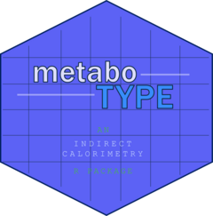

Welcome to metaboTYPE!

<!-- README.md is generated from README.Rmd. Please edit that file -->

```{r, include = FALSE}
knitr::opts_chunk$set(
  collapse = TRUE,
  comment = "#>",
  fig.path = "man/figures/README-",
  out.width = "100%"
)
```

# metaboTYPE

<!-- badges: start -->
# metaboTYPE <a href="https://meagan-kingren.github.io/metaboTYPE2.0/"></a>
<!-- badges: end -->

The goal of metaboTYPE is to enable easy alignment of multiple runs of indirect calorimetry data. This is increasingly common in well-powered studies with multiple groups. This package is designed to process time series data and then generate quick analyses and graphs. 

## Installation

You can install the development version of metaboTYPE from [GitHub](https://github.com/) with:

``` r
# install.packages("pak")
pak::pak("Meagan-Kingren/metaboTYPE")
```

